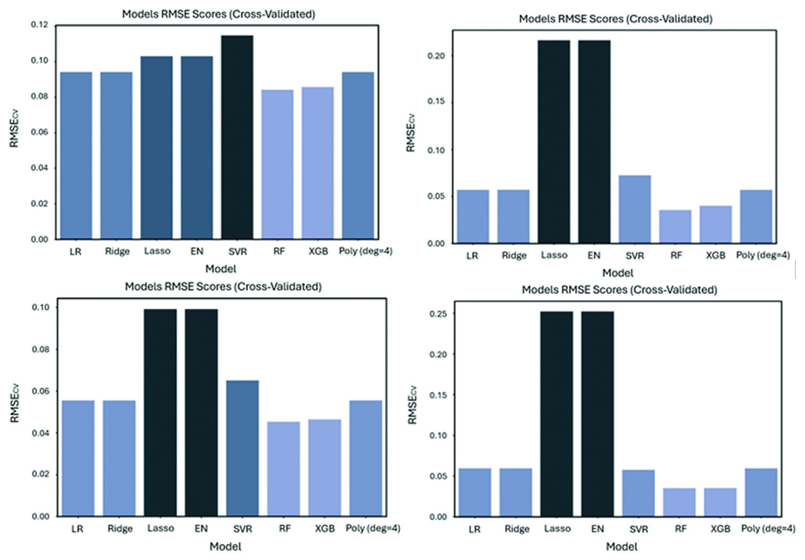

# Machine Learning for Diffusion MRI Analysis (IVIM-DKI)

[](https://www.python.org/downloads/)
[](https://opensource.org/licenses/MIT)
[](https://colab.research.google.com/github/lsprietog/public_release/blob/main/demo_colab.ipynb)

This repository hosts the source code and implementation details for the paper:

**"Exploring the Potential of Machine Learning Algorithms to Improve Diffusion Nuclear Magnetic Resonance Imaging Models Analysis"**  
*Prieto-González LS, Agulles-Pedrós L.*  
*Journal of Medical Physics, 2024.*

[Read the full paper here](https://pmc.ncbi.nlm.nih.gov/articles/PMC11309135/)

## Project Overview

Diffusion MRI analysis, particularly Intravoxel Incoherent Motion (IVIM) and Diffusion Kurtosis Imaging (DKI), often relies on non-linear least squares fitting. While standard, this approach can be computationally expensive and sensitive to noise, especially for parameters like pseudo-diffusion ($D^*$) and perfusion fraction ($f$).

This project introduces a Machine Learning framework (utilizing Random Forest, Extra Trees, and MLP) to estimate these parameters directly from the signal attenuation curve.

### Key Findings

*   **Computational Efficiency:** The ML approach reduces processing time significantly—from approximately 75 minutes to under 20 seconds for 100,000 voxels (a ~230x speedup).
*   **Noise Robustness:** The algorithms demonstrate improved stability in parameter estimation across varying SNR levels compared to conventional fitting.
*   **Versatility:** Validated across different anatomical regions (Prostate, Brain, Head & Neck) and species.


*Figure: Visual comparison of parameter maps derived from standard fitting versus the proposed ML estimation.*

## Installation

To set up the environment, clone this repository and install the required dependencies:

```bash
git clone https://github.com/lsprietog/public_release.git
cd public_release
pip install -r requirements.txt
```

## Usage Example

We provide a demonstration script `demo.py` that generates synthetic IVIM-DKI data to train and validate the model.

To run the demo locally:
```bash
python demo.py
```

### Integration with NIfTI Data

The `IVIMRegressor` class is designed to work with standard numpy arrays derived from NIfTI files.

```python
from src.ml_models import IVIMRegressor
import nibabel as nib
import numpy as np

# Example workflow
# 1. Prepare your data: Shape should be (n_voxels, n_b_values)
# X_train, y_train = load_your_data(...)

# 2. Initialize the regressor (e.g., Extra Trees)
model = IVIMRegressor(model_type='extra_trees')

# 3. Train the model
model.train(X_train, y_train)

# 4. Predict on new data
# X_new shape: (n_voxels_in_volume, n_b_values)
estimated_parameters = model.predict(X_new)
```

## Citation

If you find this repository useful for your research, please consider citing our work:

```bibtex
@article{PrietoGonzalez2024,
  title={Exploring the Potential of Machine Learning Algorithms to Improve Diffusion Nuclear Magnetic Resonance Imaging Models Analysis},
  author={Prieto-González, Leonar Steven and Agulles-Pedrós, Luis},
  journal={Journal of Medical Physics},
  volume={49},
  issue={2},
  pages={189--202},
  year={2024},
  publisher={Wolters Kluwer - Medknow},
  doi={10.4103/jmp.jmp_10_24},
  url={https://pmc.ncbi.nlm.nih.gov/articles/PMC11309135/}
}
```

## Contact

For inquiries regarding the code or the paper, please open an issue in this repository.
